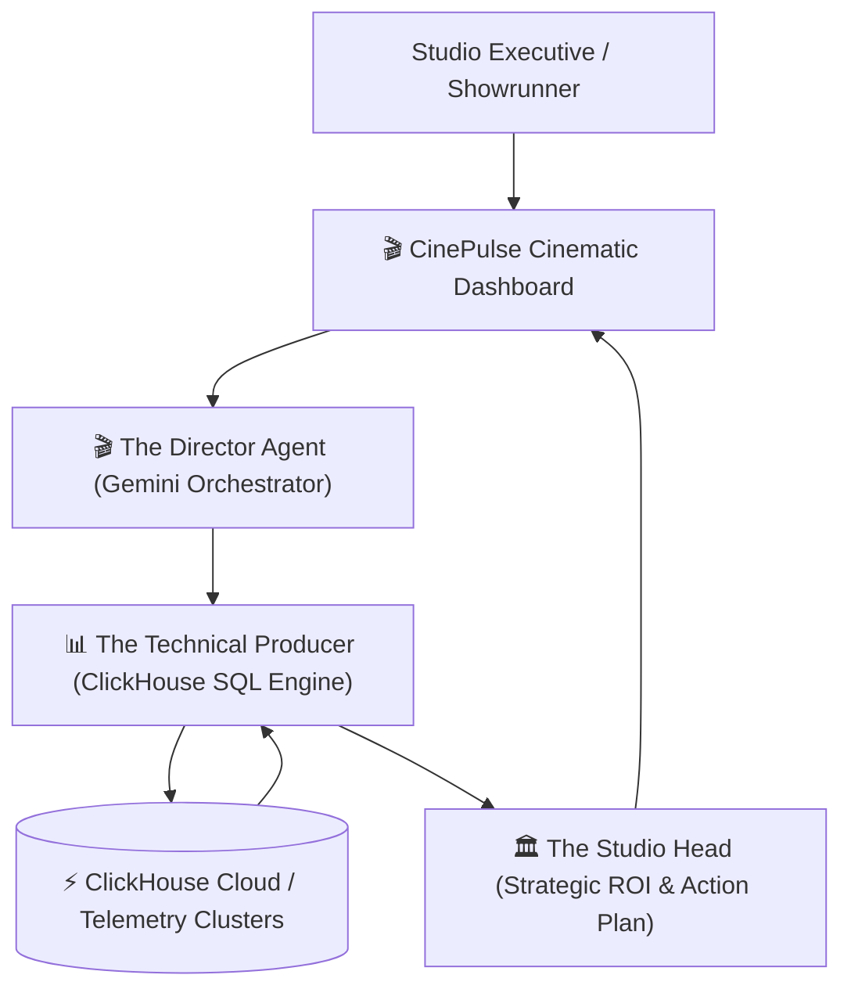

# 🎬 CinePulse AI: Autonomous Box Office & Streaming Intelligence Engine

> **Agentic Cinema: The Blockbuster Hackathon**  
> *Category / Track:* **ClickHouse Partner Track**  
> *Powered by:* **Google Cloud (Gemini 2.5 Flash)** + **ClickHouse Real-Time Analytics**  
> *License:* **MIT Open Source License**

---

## 🌟 Overview & Problem Statement

In the modern media & entertainment industry, film studios and streaming networks generate billions of streaming telemetry events, box office grosses, and audience reaction data points every day. 

However, executive decision-makers face a critical bottleneck:
- **Streaming Churn:** Viewers abandon episodes during slow-paced exposition scenes, but studios only notice weeks after release.
- **Box Office Volatility:** Marketing campaigns fail to adapt to regional ticket decay curves in real-time.
- **Latency of Analysis:** Traditional data warehouses take minutes or hours to process millions of telemetry events, missing crucial theatrical and streaming intervention windows.

**CinePulse AI** solves this by uniting **Google Gemini** multi-agent orchestration with **ClickHouse's sub-millisecond analytical speed**.

---

## 🤖 The Multi-Agent Cinematic Crew



1. **🎬 The Director Agent (Gemini Orchestrator):**  
   Interprets complex creative and business inquiries, formulates analytical investigation plans, and delegates queries.
2. **📊 The Technical Producer (ClickHouse SQL Agent):**  
   Autonomously crafts and executes optimized SQL queries against ClickHouse streaming telemetry, scene retention, and box-office tables in **< 10 milliseconds**.
3. **🏛️ The Studio Head Agent (Strategic Executive Synthesis):**  
   Translates raw SQL telemetry into tangible studio actions: scene re-edits, marketing budget reallocations, and CDN edge optimizations.

---

## 🛠️ Tech Stack & Architecture

- **LLM Reasoning & Orchestration:** Google Gemini 2.5 Flash (`google-genai` SDK)
- **Real-Time Analytical Database:** ClickHouse Cloud / `clickhouse-connect` (with in-memory engine fallback)
- **Frontend / Dashboard:** Streamlit with custom cinematic dark UI styling
- **Data Visualizations:** Plotly Interactive Charts (Scene Churn Curves, Regional Revenue Pies, Sentiment Trends)
- **Language:** Python 3.10+

---

## 🚀 Quickstart & Installation

### 1. Clone the Repository
```bash
git clone https://github.com/your-username/agentic-cinema-cinepulse.git
cd agentic-cinema-cinepulse
```

### 2. Install Dependencies
```bash
pip install -r requirements.txt
```

### 3. Configure Environment Variables (Optional)
Copy the example `.env` file:
```bash
cp .env.example .env
```
Add your credentials if available:
- `GEMINI_API_KEY`: Obtain a free key from [Google AI Studio](https://aistudio.google.com/).
- `CLICKHOUSE_HOST` & `CLICKHOUSE_PASSWORD`: Your ClickHouse Cloud cluster credentials (optional; automatically uses the high-speed local engine if omitted).

### 4. Launch the CinePulse AI Dashboard
```bash
streamlit run app.py
```
Open your browser at `http://localhost:8501`.

---

## 📊 Available Telemetry Datasets

- `box_office_daily`: Worldwide ticket revenues, screen counts, marketing expenditures, and audience ratings.
- `streaming_telemetry`: Millions of streaming sessions, completion percentages, buffering events, bitrates, and device types.
- `scene_retention_metrics`: Second-by-second scene timelines, pacing intensity scores, and viewer drop counts.
- `audience_sentiment`: Cross-platform sentiment analysis across X (Twitter), Reddit, Letterboxd, and IMDb.

---

## 📄 License
This project is open-source and licensed under the [MIT License](LICENSE).
